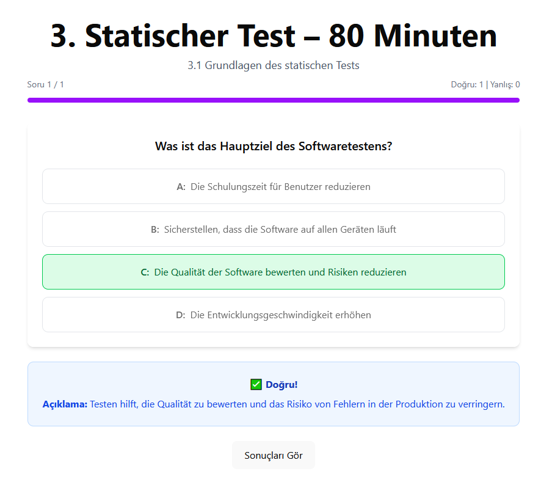
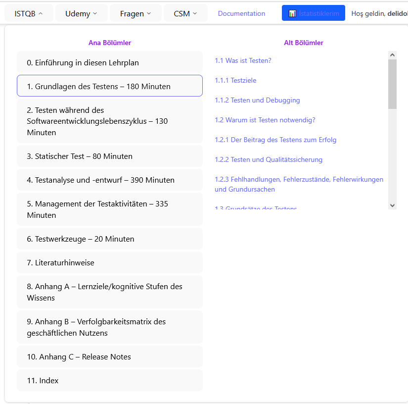
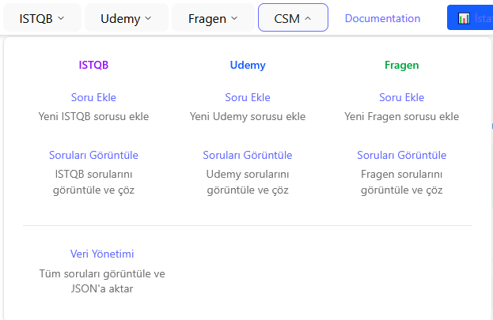
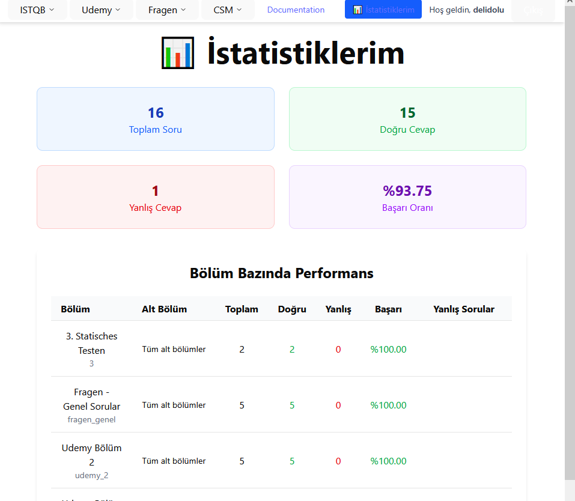

# ISTQB Quiz Application - README

Welcome to the ISTQB Quiz Application! This platform is designed to help users prepare for the ISTQB Foundation Level certification with a modern, multi-source quiz system, advanced statistics, and robust question management.

## 🚀 Features

- **Multiple Quiz Sources:** Supports ISTQB, Udemy, and Fragen question sets.
- **Comprehensive User Statistics:** Track your progress and performance across all quiz types.
- **Advanced Question Management:** Add, edit, and preview questions in real-time.
- **MySQL Database Integration:** Reliable data persistence and scalable backend.
- **Unified Quiz Interface:** Consistent user experience for all quiz types.

## 🏗️ Architecture Overview

### Frontend

- **Tech Stack:** React, TypeScript, Vite, Tailwind CSS
- **Structure:**
  - `components/` – Reusable UI components (Radix UI based)
  - `pages/` – Route-based page components (Quiz, Stats, Forms)
  - `services/` – API and data management
  - `constants/` – Static data and configuration
  - `types/` – TypeScript type definitions

### Backend

- **Tech Stack:** Node.js, Express.js, MySQL
- **Structure:**
  - `database/` – MySQL schema and connection
  - `middleware/` – Express middlewares
  - `routes/` – API endpoints
  - `server.js` – Main server file

## ⚙️ Getting Started

### Prerequisites

- Node.js v18+
- MySQL v8+
- VS Code (recommended)
- Git

### Installation

1. **Clone the repository:**

   ```bash
   git clone https://github.com/your-repo/istqb-quiz.git
   cd istqb-quiz
   ```

2. **Install dependencies:**

   ```bash
   npm install
   cd server && npm install
   ```

3. **Set up the database:**

   ```bash
   mysql -u root -p < server/database/schema.sql
   ```

4. **Configure environment variables:**
   Create a `.env` file in `server/`:

   ```env
   DB_HOST=localhost
   DB_USER=root
   DB_PASSWORD=root
   DB_NAME=istqb_quiz_app
   JWT_SECRET=your_secret_key
   ```

5. **Run the application:**
   - **Frontend:** `npm run dev`
   - **Backend:** `cd server && npm start`

## 🗂️ Project Structure

```
src/
    components/
    pages/
    services/
    constants/
    types/
server/
    database/
    middleware/
    routes/
    server.js
```

## 🛠️ Development Commands

- **Frontend development:** `npm run dev`
- **Backend development:** `cd server && npm start`
- **Type checking:** `npm run type-check`
- **Build for production:** `npm run build`

## 🧪 Testing

- **Unit Testing:** Jest + React Testing Library
- **API Testing:** Supertest
- **E2E Testing:** Cypress

> **Note:** Testing setup is recommended but not fully implemented yet.

## 📊 Database Schema

- `chapters (id VARCHAR, title, description)`
- `sub_chapters (id VARCHAR, chapter_id, title, description)`
- `questions (id BIGINT, chapter_id, sub_chapter_id, question, explanation)`
- `question_options (id BIGINT, question_id, option_text, is_correct, option_order)`
- `users (id INT, username, email, password_hash)`
- `user_question_attempts (id BIGINT, user_id, question_id, chapter_id, sub_chapter_id, selected_answer, is_correct, attempt_number)`

## 📚 Code Standards

- **TypeScript:** Strict type checking, interfaces for all data structures
- **Components:** Functional with hooks, clear props interfaces
- **API:** RESTful, JSON responses, proper HTTP status codes, error handling middleware

## 📝 Roadmap

- [ ] Populate sub-chapters table and ensure foreign key consistency
- [ ] Implement advanced question search and filtering
- [ ] Add analytics dashboard
- [ ] Improve mobile responsiveness and accessibility
- [ ] Add offline support and progressive loading

## 🤝 Contributing

Contributions are welcome! Please open issues or submit pull requests for improvements and bug fixes.

## 📄 License

This project is licensed under the MIT License.

---

**Maintainer:**

- `IstqbQuizPage.tsx` component reuse with props:
  - `quizType: 'istqb' | 'udemy' | 'fragen'`
  - `title: string`
- Route mapping:
  - `/csm/istqb-quiz` → IstqbQuizPage (default)
  - `/csm/udemy-quiz` → IstqbQuizPage quizType="udemy"
  - `/csm/fragen-quiz` → IstqbQuizPage quizType="fragen"

**Benefits:**

- Code reusability
- Consistent UX across quiz types
- Maintainable architecture

## 🔍 Key Technical Decisions

### 1. Sub-Chapter ID Strategy

**Decision:** Set all sub_chapter_id to null initially
**Reasoning:**

- Database schema support hazır ama sub_chapter data'sı henüz populate edilmemiş
- Foreign key constraint'leri koruyor
- İleride sub_chapter data'sı eklendiğinde kolayca genişletilebilir

### 2. Answer Recording Architecture

**Client-side flow:**

```typescript
// 1. Frontend answer selection
handleAnswerSelect(option: string) →

// 2. Sub-chapter ID calculation based on quiz type
calculateSubChapterId(quizType, currentChapter, subChapter) →

// 3. API call
DataService.recordUserAnswer(userId, questionId, chapterId, subChapterId, answer, isCorrect) →

// 4. Backend processing
server.js: /api/user-stats/answer endpoint →

// 5. Database insertion
INSERT INTO user_question_attempts (...)
```

### 3. Statistics System Design

**Multi-source support:**

- UserStatsPage.tsx dinamik chapter title handling
- Backend'den gelen chapter bilgileri frontend constants'larla merge
- Cross-quiz-type performance comparison

### 4. Modern Pagination System

**Design Philosophy:** Smart pagination with ellipsis for better UX when dealing with many questions

**Implementation:**

```typescript
// Smart pagination logic in QuizPage.tsx
const getPaginationItems = () => {
  const totalPages = questions.length;
  const currentPage = currentQuestionIndex + 1;
  const delta = 2; // Number of pages to show on each side of current page

  const items = [];

  // Always show first page
  if (totalPages > 0) {
    items.push(1);
  }

  // Calculate start and end of visible range
  let start = Math.max(2, currentPage - delta);
  let end = Math.min(totalPages - 1, currentPage + delta);

  // Add ellipsis after first page if needed
  if (start > 2) {
    items.push("ellipsis-start");
  }

  // Add pages in visible range
  for (let i = start; i <= end; i++) {
    if (i !== 1 && i !== totalPages) {
      items.push(i);
    }
  }

  // Add ellipsis before last page if needed
  if (end < totalPages - 1) {
    items.push("ellipsis-end");
  }

  // Always show last page (if different from first)
  if (totalPages > 1) {
    items.push(totalPages);
  }

  return items;
};
```

**Pagination Behavior Examples:**

```
# Few questions (≤7): Show all pages
[← Önceki] [1] [2] [3] [4] [5] [Sonraki →]

# Many questions, current page 1:
[← Önceki] [1] [2] [3] [...] [30] [Sonraki →]

# Many questions, current page 15:
[← Önceki] [1] [...] [13] [14] [15] [16] [17] [...] [30] [Sonraki →]

# Many questions, current page 30:
[← Önceki] [1] [...] [28] [29] [30] [Sonraki →]
```

**Features:**

- **Delta strategy**: Shows current page ± 2 pages
- **Always visible**: First and last pages always shown
- **Ellipsis indication**: `...` shows when pages are hidden
- **Answered questions**: Green highlighting preserved
- **Mobile friendly**: Fewer buttons, better responsive design

**Benefits:**

- Cleaner UI with manageable number of page buttons
- Better performance (fewer DOM elements)
- Standard UX pattern users expect
- Scalable for any number of questions

## 🐛 Critical Bug Fixes

### 1. Foreign Key Constraint Fix

**Files:** `server.js`
**Issue:** Sub-chapter ID mapping hatası
**Fix:** Null assignment strategy

### 2. Question Update API Fix

**Files:** `server.js`, `dataService.ts`
**Issue:** Column name mismatch (correct_answer vs is_correct)
**Fix:** Options table'da is_correct flag kullanımı

### 3. Route Configuration

**Files:** `App.tsx`, `NavigationMenuDemo.tsx`
**Issue:** Udemy ve Fragen quiz sayfaları eksikti
**Fix:** Unified component approach with props

### 4. Modern Pagination Implementation

**Files:** `QuizPage.tsx`
**Issue:** Too many page numbers showing for quizzes with many questions
**Fix:** Smart pagination with ellipsis and limited visible range

**Technical Details:**

- Implemented `getPaginationItems()` function with delta strategy
- Added `PaginationEllipsis` component import
- Delta = 2 (shows current ± 2 pages)
- Always shows first and last pages
- Automatic ellipsis insertion for gaps
- Maintains answered question highlighting (green)

## 📊 Database Schema Evolution

### Current Schema:

```sql
chapters (id VARCHAR, title, description)
sub_chapters (id VARCHAR, chapter_id, title, description)
questions (id BIGINT, chapter_id, sub_chapter_id, question, explanation)
question_options (id BIGINT, question_id, option_text, is_correct, option_order)
users (id INT, username, email, password_hash)
user_question_attempts (id BIGINT, user_id, question_id, chapter_id, sub_chapter_id, selected_answer, is_correct, attempt_number)
```

### Schema Notes:

- `sub_chapters.id` VARCHAR kullanıyor ama `user_question_attempts.sub_chapter_id` integer foreign key bekliyor
- Bu mismatch'i çözmek için mapping logic kullanılıyor
- Future improvement: Schema consistency sağlanabilir

## 🚀 Performance Optimizations

### 1. API Caching Strategy

- Frontend'de localStorage fallback
- Backend'de MySQL connection pooling
- Question loading optimization

### 2. Component Optimization

- React.memo usage için opportunities
- Lazy loading for large question sets
- State management optimization

## 🔮 Future Development Roadmap

### 1. Database Schema Improvements

- [ ] Sub-chapters table population
- [ ] Foreign key consistency fixes
- [ ] Migration scripts

### 2. Advanced Features

- [ ] Question search and filtering
- [ ] Bulk question operations
- [ ] Export/import improvements
- [ ] Analytics dashboard

### 3. Performance & UX

- [ ] Progressive loading
- [ ] Offline support
- [ ] Mobile responsive improvements
- [ ] Accessibility enhancements
- [x] Modern pagination with ellipsis (completed)

## 🛠️ Development Environment

### Required Tools:

- Node.js v18+
- MySQL v8+
- VS Code (recommended)
- Git

### Development Commands:

```bash
# Frontend development
npm run dev

# Backend development
cd server && npm start

# Database reset
mysql -u root -p < server/database/schema.sql

# Type checking
npm run type-check

# Build for production
npm run build

# Database imports and management
cd server && node fixed_import_clean.cjs     # Import all JSON questions with validation
cd server && node check_udemy_db.cjs         # Check Udemy database structure
cd server && node simple_import.cjs          # Simple import without validation
cd server && node cleanup_udemy_questions.cjs # Clean up misplaced questions
cd server && node add_missing_udemy_chapters.cjs # Add missing Udemy chapters
cd server && node fix_udemy_subchapters.cjs  # Fix Udemy sub-chapter structure
```

### Environment Variables:

```env
# Backend (.env)
DB_HOST=localhost
DB_USER=root
DB_PASSWORD=root
DB_NAME=istqb_quiz_app
JWT_SECRET=your_secret_key
```

## 📚 Code Style & Standards

### TypeScript Usage:

- Strict type checking enabled
- Interface definitions for all data structures
- Proper error handling with try-catch

### Component Standards:

- Functional components with hooks
- Props interface definitions
- Consistent naming conventions

### API Standards:

- RESTful endpoint design
- JSON response format
- Proper HTTP status codes
- Error handling middleware

## 🧪 Testing Strategy

### Current Testing Status:

- [ ] Unit tests for components
- [ ] API endpoint testing
- [ ] Database integration tests
- [ ] E2E testing setup

### Testing Framework Recommendations:

- Jest + React Testing Library
- Supertest for API testing
- Cypress for E2E testing

---

**Last Updated:** September 2025  
**Project Status:** Active Development  
**Maintainer:** [@1DeliDolu](https://github.com/1DeliDolu)

## Exampels:

### Soru Ekranı



### Navigasyon Menüsü



### İçerik Yönetim Sistemi (CMS)



### İstatistikler



### question update


