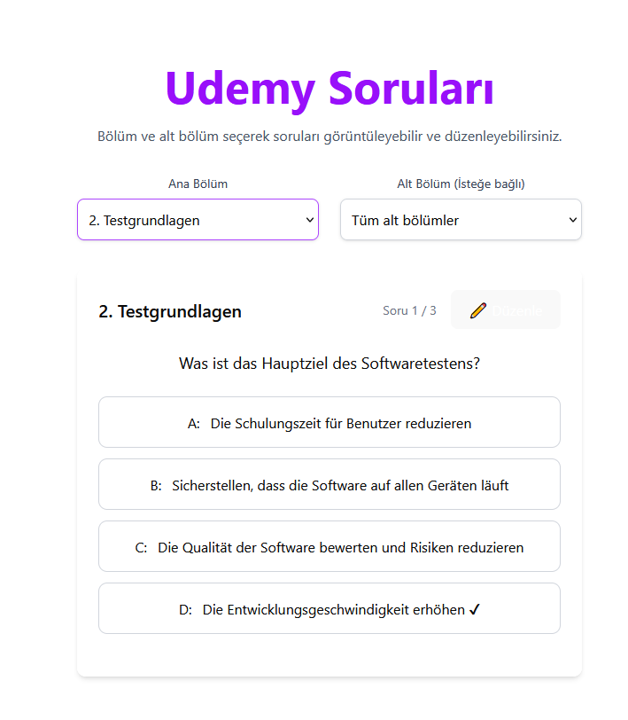

# ISTQB Quiz Application - Developer Documentation

Welcome to the ISTQB Quiz Application! This platform is designed to help users prepare for the ISTQB Foundation Level certification with a modern, multi-source quiz system, advanced statistics, and robust question management.

## 🚀 Features

- **Multiple Quiz Sources:** Supports ISTQB, Udemy, and Fragen question sets with 14 sub-categories
- **Fragen Question System:** Dedicated Turkish/German ISTQB preparation materials with proper categorization
- **Modern Pagination:** Smart pagination with ellipsis for large question sets (✨ NEW)
- **Comprehensive User Statistics:** Track your progress and performance across all quiz types
- **Advanced Question Management:** Add, edit, and preview questions in real-time
- **MySQL Database Integration:** Reliable data persistence with proper foreign key relationships
- **Unified Quiz Interface:** Consistent user experience for all quiz types

## 🏗️ Architecture Overview

### Frontend

- **Tech Stack:** React 18, TypeScript, Vite, Tailwind CSS, Radix UI
- **Structure:**
  - `src/components/` – Reusable UI components (Radix UI based)
  - `src/pages/` – Route-based page components (Quiz, Stats, Forms)
  - `src/services/` – API and data management services
  - `src/constants/` – Static data and configuration
  - `src/types/` – TypeScript type definitions
  - `src/lib/` – Utility functions

### Backend

- **Tech Stack:** Node.js, Express.js, MySQL2, JWT Authentication
- **Structure:**
  - `server/database/` – MySQL schema and connection pool
  - `server/server.js` – Main Express server with all API endpoints
  - Database scripts for import/export and management

## ⚙️ Getting Started

### Prerequisites

- Node.js v18+
- MySQL v8+
- VS Code (recommended)
- Git

### Installation

1. **Clone the repository:**

   ```bash
   git clone https://github.com/1DeliDolu/istqb-quiz.git
   cd istqb-quiz
   ```

2. **Install dependencies:**

   ```bash
   npm install
   cd server && npm install
   ```

3. **Set up the database:**

   ```bash
   mysql -u root -p < server/database/schema.sql
   ```

4. **Configure environment variables:**
   Create a `.env` file in `server/`:

   ```env
   DB_HOST=localhost
   DB_USER=root
   DB_PASSWORD=your_password
   DB_NAME=istqb_quiz_app
   JWT_SECRET=your_secret_key
   PORT=3002
   ```

5. **Run the application:**
   - **Frontend:** `npm run dev` (http://localhost:5173)
     - **Backend:** `cd server && npm start` (http://localhost:3002)

## 🗂️ Project Structure

```
istqb-quiz/
├── src/                          # Frontend React application
│   ├── components/               # Reusable UI components
│   │   ├── ui/                  # Radix UI components
│   │   ├── Navbar.tsx           # Main navigation
│   │   └── NavigationMenuDemo.tsx
│   ├── pages/                   # Route components
│   │   ├── IstqbQuizPage.tsx    # Main quiz interface
│   │   ├── QuizPage.tsx         # Quiz with pagination
│   │   ├── UserStatsPage.tsx    # Statistics dashboard
│   │   ├── DataManagementPage.tsx
│   │   ├── FragenPage.tsx       # Fragen question form
│   │   ├── UdemyPage.tsx        # Udemy question form
│   │   ├── LoginPage.tsx        # Authentication
│   │   └── RegisterPage.tsx     # User registration
│   ├── services/                # API services
│   │   └── dataService.ts       # Main data service
│   ├── constants/               # Static data
│   │   ├── istqbChapters.ts     # ISTQB chapter definitions
│   │   ├── udemyChapters.ts     # Udemy chapter definitions
│   │   └── fragenChapters.ts    # Fragen chapter definitions
│   ├── types/                   # TypeScript types
│   │   └── chapters.ts          # Chapter type definitions
│   └── lib/                     # Utilities
│       └── utils.ts             # Helper functions
├── server/                      # Backend Node.js application
│   ├── database/                # Database configuration
│   │   ├── connection.js        # MySQL connection pool
│   │   └── schema.sql           # Database schema
│   ├── server.js                # Main Express server
│   └── [import scripts]         # Database import utilities
├── json/                        # Question data files
│   ├── istqb/                   # ISTQB questions by chapter
│   ├── udemy/                   # Udemy questions by chapter
│   └── fragen/                  # Fragen questions
│       ├── Genel/               # Turkish general questions
│       ├── Deutsch/             # German questions
│       ├── Praxis/              # Practical testing questions
│       └── Mixed/               # Mixed difficulty questions
└── public/                      # Static assets
    └── img/                     # Application screenshots
```

## 📚 Fragen Question System

### Overview

The Fragen system provides a dedicated question source for Turkish and German ISTQB preparation materials.

### File Structure

```
json/fragen/
├── Genel/          # Turkish general questions (4 files)
│   ├── fragen_genel_1.json (Temel Kavramlar)
│   ├── fragen_genel_2.json (Test Teknikleri)
│   ├── fragen_genel_3.json (Test Yönetimi)
│   └── fragen_genel_4.json (Pratik Uygulamalar)
├── Deutsch/        # German questions (3 files)
│   ├── fragen_deutsch_1.json (Grundlagen)
│   ├── fragen_deutsch_2.json (Fortgeschritten)
│   └── fragen_deutsch_3.json (Praxis)
├── Praxis/         # Practical testing questions (4 files)
│   ├── fragen_praxis_1.json (Web Testing)
│   ├── fragen_praxis_2.json (Mobile Testing)
│   ├── fragen_praxis_3.json (API Testing)
│   └── fragen_praxis_4.json (Performance Testing)
└── Mixed/          # Mixed difficulty questions (3 files)
    ├── fragen_mixed_1.json (Kolay Seviye)
    ├── fragen_mixed_2.json (Orta Seviye)
    └── fragen_mixed_3.json (Zor Seviye)
```

### Database Integration

- **Chapters:** 4 main categories (fragen_genel, fragen_deutsch, fragen_praxis, fragen_mixed)
- **Sub-chapters:** 14 sub-categories with proper Turkish/German titles
- **Source tracking:** Uses `source = 'fragen'` for data separation
- **Foreign key compliance:** Proper sub_chapter_id mapping

### JSON Format

```json
{
  "chapter": "fragen_genel",
  "subChapter": "genel_1",
  "subChapterTitle": "Genel.1 Temel Kavramlar",
  "questions": [
    {
      "question": "Question text...",
      "explanation": "Explanation text...",
      "options": [
        { "text": "Option A", "correct": true },
        { "text": "Option B", "correct": false },
        { "text": "Option C", "correct": false },
        { "text": "Option D", "correct": false }
      ]
    }
  ]
}
```

## 🔍 Key Technical Decisions

### 1. Fragen Import Database Strategy ✨ NEW

**Problem:** Initial import script failed due to foreign key constraints and missing source column  
**Solution:** Adopted working pattern from `fixed_import_clean.cjs`

**Key fixes:**

- **Source column usage:** Added `source = 'fragen'` for proper data separation
- **Sub-chapter ID mapping:** Dynamic lookup from database using title matching
- **Foreign key compliance:** Proper sub_chapter_id resolution instead of NULL values
- **Transaction handling:** Proper database cleanup and commit strategies

**Technical implementation:**

```javascript
// Dynamic sub-chapter ID resolution
const [subChapterResult] = await db.execute(
  "SELECT id FROM sub_chapters WHERE chapter_id = ? AND title = ?",
  [jsonData.chapter, jsonData.subChapterTitle]
);

// Source-aware insertion
const [questionResult] = await db.execute(
  "INSERT INTO questions (chapter_id, sub_chapter_id, question, explanation, source) VALUES (?, ?, ?, ?, ?)",
  [
    jsonData.chapter,
    subChapterId,
    question.question,
    question.explanation || "",
    "fragen",
  ]
);
```

### 2. Unified Quiz Component Architecture

**Decision:** Reuse `IstqbQuizPage.tsx` component with props for all quiz types  
**Benefits:**

- Code reusability across ISTQB, Udemy, and Fragen quizzes
- Consistent user experience
- Maintainable architecture

**Implementation:**

```typescript
interface QuizPageProps {
  quizType?: "istqb" | "udemy" | "fragen";
  title?: string;
}

// Route mapping:
// /cms/istqb-quiz → IstqbQuizPage (default)
// /cms/udemy-quiz → IstqbQuizPage quizType="udemy"
// /cms/fragen-quiz → IstqbQuizPage quizType="fragen"
```

## 🗂️ Project Structure

```
src/
    components/
    pages/
    services/
    constants/
    types/
server/
    database/
    middleware/
    routes/
    server.js
```

## 🛠️ Development Commands

- **Frontend development:** `npm run dev`
- **Backend development:** `cd server && npm start`
- **Type checking:** `npm run type-check`
- **Build for production:** `npm run build`

## 🧪 Testing

- **Unit Testing:** Jest + React Testing Library
- **API Testing:** Supertest
- **E2E Testing:** Cypress

> **Note:** Testing setup is recommended but not fully implemented yet.

## 📊 Database Schema

- `chapters (id VARCHAR, title, description)`
- `sub_chapters (id VARCHAR, chapter_id, title, description)`
- `questions (id BIGINT, chapter_id, sub_chapter_id, question, explanation)`
- `question_options (id BIGINT, question_id, option_text, is_correct, option_order)`
- `users (id INT, username, email, password_hash)`
- `user_question_attempts (id BIGINT, user_id, question_id, chapter_id, sub_chapter_id, selected_answer, is_correct, attempt_number)`

## 📚 Code Standards

- **TypeScript:** Strict type checking, interfaces for all data structures
- **Components:** Functional with hooks, clear props interfaces
- **API:** RESTful, JSON responses, proper HTTP status codes, error handling middleware

## 📝 Roadmap

- [ ] Populate sub-chapters table and ensure foreign key consistency
- [ ] Implement advanced question search and filtering
- [ ] Add analytics dashboard
- [ ] Improve mobile responsiveness and accessibility
- [ ] Add offline support and progressive loading

## 🤝 Contributing

Contributions are welcome! Please open issues or submit pull requests for improvements and bug fixes.

## 📄 License

This project is licensed under the MIT License.

---

**Maintainer:**

- `IstqbQuizPage.tsx` component reuse with props:
  - `quizType: 'istqb' | 'udemy' | 'fragen'`
  - `title: string`
- Route mapping:
  - `/cms/istqb-quiz` → IstqbQuizPage (default)
  - `/cms/udemy-quiz` → IstqbQuizPage quizType="udemy"
  - `/cms/fragen-quiz` → IstqbQuizPage quizType="fragen"

**Benefits:**

- Code reusability
- Consistent UX across quiz types
- Maintainable architecture

## � Fragen Question System

### Overview

The Fragen system provides a dedicated question source for Turkish and German ISTQB preparation materials.

### Structure

```
json/fragen/
├── Genel/          # Turkish general questions
│   ├── fragen_genel_1.json (Temel Kavramlar)
│   ├── fragen_genel_2.json (Test Teknikleri)
│   ├── fragen_genel_3.json (Test Yönetimi)
│   └── fragen_genel_4.json (Pratik Uygulamalar)
├── Deutsch/        # German questions
│   ├── fragen_deutsch_1.json (Grundlagen)
│   ├── fragen_deutsch_2.json (Fortgeschritten)
│   └── fragen_deutsch_3.json (Praxis)
├── Praxis/         # Practical testing questions
│   ├── fragen_praxis_1.json (Web Testing)
│   ├── fragen_praxis_2.json (Mobile Testing)
│   ├── fragen_praxis_3.json (API Testing)
│   └── fragen_praxis_4.json (Performance Testing)
└── Mixed/          # Mixed difficulty questions
    ├── fragen_mixed_1.json (Kolay Seviye)
    ├── fragen_mixed_2.json (Orta Seviye)
    └── fragen_mixed_3.json (Zor Seviye)
```

### Database Integration

- **Chapters:** 4 main categories (fragen_genel, fragen_deutsch, fragen_praxis, fragen_mixed)
- **Sub-chapters:** 14 sub-categories with proper Turkish/German titles
- **Source tracking:** Uses `source = 'fragen'` for data separation
- **Foreign key compliance:** Proper sub_chapter_id mapping

### JSON Format

```json
{
  "chapter": "fragen_genel",
  "subChapter": "genel_1",
  "subChapterTitle": "Genel.1 Temel Kavramlar",
  "questions": [
    {
      "question": "Question text...",
      "explanation": "Explanation text...",
      "options": [
        { "text": "Option A", "correct": true },
        { "text": "Option B", "correct": false }
      ]
    }
  ]
}
```

### Import Process

1. **Setup:** Run `add_fragen_chapters.cjs` to create database structure
2. **Import:** Run `import_fragen_questions.cjs` to load questions
3. **Validation:** Automatic sub-chapter ID mapping and validation
4. **Cleanup:** Existing questions are removed before new import

## �🔍 Key Technical Decisions

### 1. Sub-Chapter ID Strategy

**Decision:** Set all sub_chapter_id to null initially
**Reasoning:**

- Database schema support hazır ama sub_chapter data'sı henüz populate edilmemiş
- Foreign key constraint'leri koruyor
- İleride sub_chapter data'sı eklendiğinde kolayca genişletilebilir

### 3. Answer Recording Architecture

### 3. Modern Pagination System

**Design Philosophy:** Smart pagination with ellipsis for better UX when dealing with many questions

**Implementation:**

```typescript
const getPaginationItems = () => {
  const totalPages = questions.length;
  const currentPage = currentQuestionIndex + 1;
  const delta = 2; // Number of pages to show on each side of current page

  // Logic for smart pagination with ellipsis
  // Always shows first and last pages
  // Shows current page ± 2 pages
  // Adds ellipsis (...) when pages are hidden
};
```

**Pagination Examples:**

```
# Few questions (≤7): Show all pages
[← Previous] [1] [2] [3] [4] [5] [Next →]

# Many questions, current page 1:
[← Previous] [1] [2] [3] [...] [30] [Next →]

# Many questions, current page 15:
[← Previous] [1] [...] [13] [14] [15] [16] [17] [...] [30] [Next →]

# Many questions, current page 30:
[← Previous] [1] [...] [28] [29] [30] [Next →]
```

### 4. Answer Recording Architecture

**Client-side flow:**

```typescript
// 1. Frontend answer selection
handleAnswerSelect(option: string) →

// 2. Sub-chapter ID calculation based on quiz type
calculateSubChapterId(quizType, currentChapter, subChapter) →

// 3. API call
DataService.recordUserAnswer(userId, questionId, chapterId, subChapterId, answer, isCorrect) →

// 4. Backend processing
server.js: /api/user-stats/answer endpoint →

// 5. Database insertion
INSERT INTO user_question_attempts (...)
```

### 5. Multi-Source Statistics System

**Features:**

- Dynamic chapter title handling across different sources
- Cross-quiz-type performance comparison
- Detailed wrong answer tracking
- Chapter-based progress tracking

## 📊 Database Schema

### Core Tables

```sql
chapters (
  id VARCHAR PRIMARY KEY,
  title VARCHAR(255),
  description TEXT
)

sub_chapters (
  id VARCHAR PRIMARY KEY,
  chapter_id VARCHAR,
  title VARCHAR(255),
  description TEXT,
  FOREIGN KEY (chapter_id) REFERENCES chapters(id)
)

questions (
  id BIGINT AUTO_INCREMENT PRIMARY KEY,
  chapter_id VARCHAR,
  sub_chapter_id VARCHAR,
  question TEXT,
  explanation TEXT,
  source VARCHAR(50),
  FOREIGN KEY (chapter_id) REFERENCES chapters(id),
  FOREIGN KEY (sub_chapter_id) REFERENCES sub_chapters(id)
)

question_options (
  id BIGINT AUTO_INCREMENT PRIMARY KEY,
  question_id BIGINT,
  option_text TEXT,
  is_correct BOOLEAN,
  option_order INT,
  FOREIGN KEY (question_id) REFERENCES questions(id)
)
```

### User & Statistics Tables

```sql
users (
  id INT AUTO_INCREMENT PRIMARY KEY,
  username VARCHAR(50) UNIQUE,
  email VARCHAR(100) UNIQUE,
  password_hash VARCHAR(255),
  first_name VARCHAR(50),
  last_name VARCHAR(50),
  created_at TIMESTAMP DEFAULT CURRENT_TIMESTAMP
)

user_question_attempts (
  id BIGINT AUTO_INCREMENT PRIMARY KEY,
  user_id INT,
  question_id BIGINT,
  chapter_id VARCHAR,
  sub_chapter_id VARCHAR,
  selected_answer TEXT,
  is_correct BOOLEAN,
  attempt_number INT,
  answered_at TIMESTAMP DEFAULT CURRENT_TIMESTAMP,
  FOREIGN KEY (user_id) REFERENCES users(id),
  FOREIGN KEY (question_id) REFERENCES questions(id)
)
```

## �️ Development Commands

### Frontend Development

```bash
npm run dev              # Start development server (localhost:5173)
npm run build           # Build for production
npm run preview         # Preview production build
npm run type-check      # TypeScript type checking
```

### Backend Development

```bash
cd server && npm start   # Start Express server (localhost:3002)
cd server && npm run dev # Start with nodemon for development
```

### Database Management

```bash
# Database reset
mysql -u root -p < server/database/schema.sql

# Import scripts (run from server/ directory)
node fixed_import_clean.cjs          # Import all JSON questions with validation
node import_fragen_questions.cjs     # Import only Fragen questions ✅ WORKING
node check_udemy_db.cjs             # Check Udemy database structure
node add_fragen_chapters.cjs        # Add Fragen chapters and sub-chapters ✅ REQUIRED FIRST

# Fragen-specific import workflow (COMPLETE SOLUTION):
# 1. First, ensure database structure:
node add_fragen_chapters.cjs        # Creates 4 chapters + 14 sub-chapters

# 2. Then import questions:
node import_fragen_questions.cjs    # Imports questions with proper sub-chapter mapping
```

### Fragen Import Features

- Supports 4 main categories: Genel, Deutsch, Praxis, Mixed
- 14 total sub-chapters with proper Turkish/German titles
- Uses 'source' column for data separation
- Foreign key compliant with sub_chapters table
- Automatic cleanup of existing questions on re-import
- Detailed logging and error handling

## 🔗 API Endpoints

### Question Management

```
GET    /api/questions/:chapter        # Get questions by chapter
POST   /api/questions               # Add new question
PUT    /api/questions/:id           # Update question
DELETE /api/questions/:chapter      # Delete all questions in chapter
GET    /api/chapters                # List all chapters
```

### Authentication

```
POST   /api/auth/register           # User registration
POST   /api/auth/login              # User login
GET    /api/auth/profile            # Get user profile
```

### User Statistics

```
POST   /api/user-stats/answer       # Record user answer
GET    /api/user-stats/:userId      # Get user statistics
GET    /api/user-stats/:userId/wrong-answers/:chapterId  # Get wrong answers
```

### Health Check

```
GET    /api/health                  # Server health status
```

## 🧪 Testing Strategy

### Current Status

- [ ] Unit tests for React components
- [ ] API endpoint testing
- [ ] Database integration tests
- [ ] E2E testing setup

### Recommended Tools

- **Frontend:** Jest + React Testing Library
- **Backend:** Supertest + Jest
- **E2E:** Cypress or Playwright
- **Database:** Test containers with MySQL

## 🚀 Performance Optimizations

### Frontend

- React.memo for component optimization
- Lazy loading for large question sets
- Local storage caching for user preferences
- Optimized pagination rendering

### Backend

- MySQL connection pooling
- Prepared statements for SQL queries
- JWT token-based authentication
- CORS optimization for development

### Database

- Proper indexing on frequently queried columns
- Foreign key constraints for data integrity
- Connection pooling for better performance

## 🔮 Future Development Roadmap

### Phase 1: Core Improvements

- [ ] Complete test coverage implementation
- [ ] Advanced question search and filtering
- [ ] Bulk question operations
- [ ] Enhanced analytics dashboard

### Phase 2: Features

- [ ] Question difficulty rating system
- [ ] Timed quiz mode
- [ ] Achievement system
- [ ] Export quiz results to PDF

### Phase 3: Technical Debt

- [ ] Database schema consistency improvements
- [ ] Migration to TypeScript backend
- [ ] API rate limiting
- [ ] Enhanced error handling

### Phase 4: Scaling

- [ ] Redis caching layer
- [ ] Database sharding considerations
- [ ] CDN integration for static assets
- [ ] Mobile app development

## 🔧 Environment Configuration

### Development Environment

```env
# Frontend (.env.local)
VITE_API_BASE_URL=http://localhost:3002/api

# Backend (.env)
DB_HOST=localhost
DB_USER=root
DB_PASSWORD=your_password
DB_NAME=istqb_quiz_app
JWT_SECRET=your_secret_key
PORT=3002
NODE_ENV=development
```

### Production Environment

```env
# Backend (.env.production)
DB_HOST=your_production_host
DB_USER=your_production_user
DB_PASSWORD=your_secure_password
DB_NAME=istqb_quiz_app
JWT_SECRET=your_super_secure_secret
PORT=3002
NODE_ENV=production
```

## 📚 Code Style & Standards

### TypeScript

- Strict type checking enabled
- Interface definitions for all data structures
- Proper error handling with try-catch blocks
- Consistent naming conventions (camelCase)

### React Components

- Functional components with hooks
- Props interface definitions
- Consistent import ordering
- Proper component composition

### Backend

- RESTful API design principles
- Proper HTTP status codes
- Error handling middleware
- Consistent response format

### Database

- Descriptive table and column names
- Proper foreign key relationships
- Consistent data types
- Well-documented schema

## 🤝 Contributing

### Getting Started

1. Fork the repository
2. Create a feature branch (`git checkout -b feature/amazing-feature`)
3. Make your changes
4. Add tests if applicable
5. Commit your changes (`git commit -m 'Add some amazing feature'`)
6. Push to the branch (`git push origin feature/amazing-feature`)
7. Open a Pull Request

### Code Review Process

- All changes require pull request review
- Automated tests must pass
- Code style must follow project standards
- Documentation must be updated for new features

## 📄 License

This project is licensed under the MIT License - see the [LICENSE](LICENSE) file for details.

---

**Last Updated:** September 2025  
**Project Status:** Active Development  
**Maintainer:** [@1DeliDolu](https://github.com/1DeliDolu)

## 📷 Application Screenshots

### Quiz Interface


### Navigation Menu


### Content Management System


### Statistics Dashboard


### Question Update Interface




# TEST

## Frontend Testing (Vitest + RTL)

- Gerekli paketler: `vitest`, `jsdom`, `@testing-library/react`, `@testing-library/user-event`, `@testing-library/jest-dom`, `@vitest/coverage-v8`
- Önerilen: `msw` (API mocklama), `whatwg-fetch` (fetch polyfill)

Kurulum (root):

```bash
npm i -D vitest jsdom @testing-library/react @testing-library/user-event @testing-library/jest-dom @vitest/coverage-v8 msw whatwg-fetch
```

Konfigürasyon:

1) `vitest.config.ts` (root)

```ts
import { defineConfig } from 'vitest/config'

export default defineConfig({
  test: {
    environment: 'jsdom',
    setupFiles: ['src/test/setup.ts'],
    globals: true,
    coverage: { provider: 'v8' },
  },
})
```

2) `src/test/setup.ts`

```ts
import '@testing-library/jest-dom'
import 'whatwg-fetch'
```

3) `package.json` scriptleri

```jsonc
{
  "scripts": {
    "test": "vitest",
    "test:run": "vitest run",
    "coverage": "vitest run --coverage"
  }
}
```

Örnek React testi (`src/components/__tests__/Example.test.tsx`):

```tsx
import { render, screen } from '@testing-library/react'
import React from 'react'

function Example() {
  return <button>Click me</button>
}

test('renders button', () => {
  render(<Example />)
  expect(screen.getByText('Click me')).toBeInTheDocument()
})
```

## Backend Testing (Vitest + Supertest)

- Gerekli paketler: `vitest`, `supertest`
- Kurulum (server klasöründe):

```bash
cd server && npm i -D vitest supertest
```

Seçenek 1: Test dosyası başına ortam belirtimi

```ts
// @vitest-environment node
import request from 'supertest'
import app from './server' // express app export ediliyorsa

test('GET /api/health', async () => {
  const res = await request(app).get('/api/health')
  expect(res.status).toBe(200)
})
```

Seçenek 2: `server/vitest.config.ts`

```ts
import { defineConfig } from 'vitest/config'

export default defineConfig({
  test: {
    environment: 'node',
  },
})
```

Server `package.json` scriptleri:

```jsonc
{
  "scripts": {
    "test": "vitest",
    "test:run": "vitest run"
  }
}
```

Notlar:
- Testlerde gerçek DB yerine mock veya test DB kullanın. `dotenv` ile `.env.test` yükleyebilir veya `msw`/in-memory yaklaşımlarını tercih edebilirsiniz.
- HTTP testleri için sunucuyu portta dinletmek yerine Express `app` nesnesini export etmek genelde daha stabildir.

## E2E (Opsiyonel)

- Seçenekler: `cypress` veya `@playwright/test`

Kurulum (örnek):

```bash
npm i -D cypress
# veya
npm i -D @playwright/test
```

## Çalıştırma Özetleri

- Frontend unit: `npm test` (root)
- Frontend coverage: `npm run coverage`
- Backend unit/API: `cd server && npm test`
- E2E: `npx cypress open` veya `npx playwright test`


<h1>TEST</h1>
<!-- testing  -->
