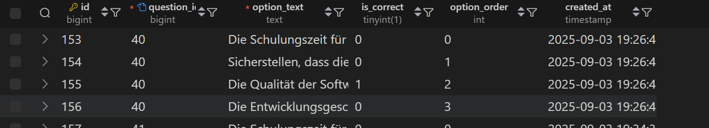
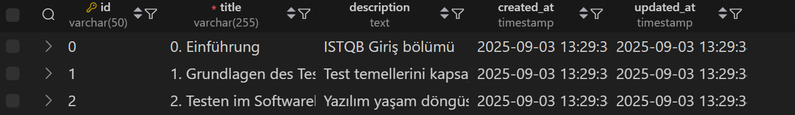
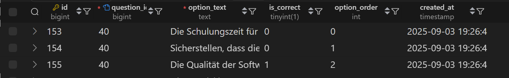
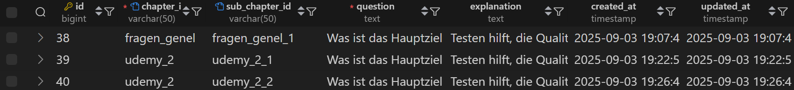
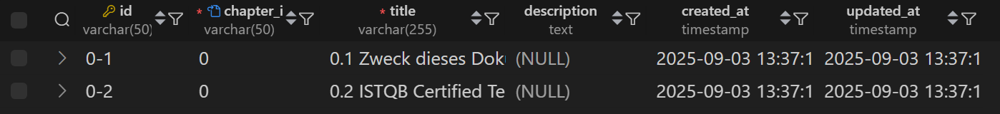
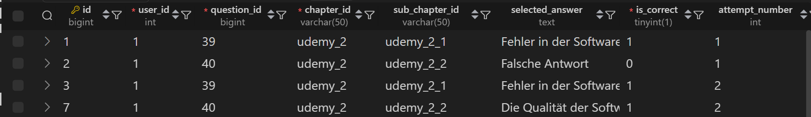

# ISTQB Quiz - Aufgabenliste

## 🔥 Priorisierte Funktionen

### 📚 Dokumentationssystem

- [ ] **Dokumentationsmodul erstellen**
  - [ ] Separate Dokumentationsseiten für jedes ISTQB-Kapitel
  - [ ] Unterstützung für Inhalte im Markdown-Format
  - [ ] Such- und Filterfunktionen
  - [ ] "Dokumentation"-Reiter zum Navigationsmenü hinzufügen

### 🎯 Intelligentes Empfehlungssystem

- [ ] **Analyse falscher Antworten**
  - [ ] Verfolge die vom Benutzer falsch beantworteten Fragen
  - [ ] Bestimme das zugehörige Kapitel für jede falsche Antwort
  - [ ] Empfehle die relevante ISTQB-Dokumentation
  - [ ] Popup "Möchten Sie dieses Thema lernen?" hinzufügen

### 📖 Dokumentationsinhalte

- [ ] **ISTQB Foundation Level Themen**
  - [ ] Kapitel 1: Grundlagen des Testens
  - [ ] Kapitel 2: Testen im SDLC
  - [ ] Kapitel 3: Statisches Testen
  - [ ] Kapitel 4: Testanalyse und -design
  - [ ] Kapitel 5: Testmanagement
  - [ ] Kapitel 6: Testwerkzeuge

### 🔗 Integration

- [ ] **Verbindung zwischen Quiz und Dokumentation**
  - [ ] Kapitelvorschläge auf der Quiz-Ergebnisseite
  - [ ] Schneller Zugriff auf relevante Quizze aus der Dokumentation
  - [ ] Lesezeichen-System (Lieblingsthemen)
  - [ ] Lesefortschritt verfolgen

### 🎨 UI/UX-Verbesserungen

- [ ] **Design der Dokumentationsseite**
  - [ ] Responsives Dokumentationslayout
  - [ ] Unterstützung für Dark-/Light-Mode
  - [ ] Inhaltsverzeichnis (TOC)
  - [ ] Syntax-Highlighting (für Codebeispiele)
  - [ ] Druckfreundliches Format

### 📊 Statistiken

- [ ] **Lernanalyse**
  - [ ] Zeige Schwächen in bestimmten Themenbereichen
  - [ ] Lesezeiten der Dokumentation
  - [ ] Erfolgsquoten pro Thema im Quiz
  - [ ] Empfohlener Lernplan

## 🔧 Technische Details

### Dokumentationsstruktur

```
src/
├── components/
│   └── documentation/
│       ├── DocumentationLayout.tsx
│       ├── ChapterContent.tsx
│       ├── TableOfContents.tsx
│       └── RecommendationPopup.tsx
├── pages/
│   └── DocumentationPage.tsx
├── data/
│   └── documentation/
│       ├── chapter1.md
│       ├── chapter2.md
│       └── ...
└── services/
    └── recommendationService.ts
```

### Empfehlungsalgorithmus

1. Analysiere die falschen Antworten nach Abschluss des Quiz
2. Bestimme das ISTQB-Kapitel für jede falsche Antwort
3. Empfehle die drei Kapitel mit den meisten Fehlern
4. Biete dem Benutzer einen direkten Link zur Dokumentation an

## ✅ Abgeschlossene Funktionen

- [x] Pagination-Navigationssystem
- [x] Beiges Button-Theme (gesamtes Projekt)
- [x] Hover-Dropdown-Navigation
- [x] Zwei-Spalten-Navigation
- [x] Quizsystem (ISTQB, Udemy, Fragen)
- [x] Benutzerstatistiken
- [x] Responsives Design








